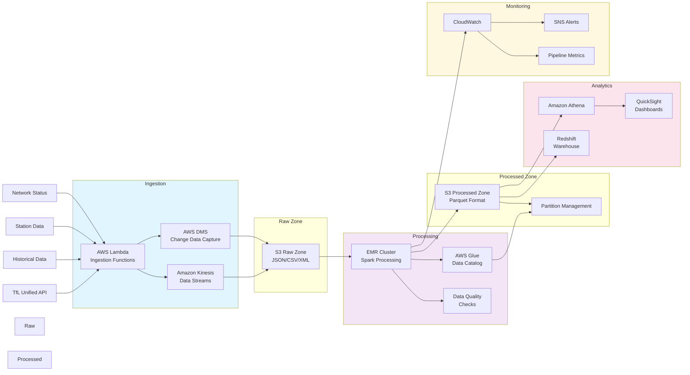

# London Travel Network - Data Engineering Architecture

## Data Pipeline Architecture

## Key Components

### Data Sources
- TfL Unified API: Real-time transport data
- Historical Data: Past journey records
- Station Data: Infrastructure information
- Network Status: Service updates

### Ingestion Layer
- Lambda Functions: API polling and data collection
- Kinesis: Stream processing for real-time data
- DMS: Change data capture for historical data

### Storage Zones
- Raw Zone: Original format data preservation
- Processed Zone: Optimized Parquet storage
- Analytics Zone: Query-optimized views

### Processing
- EMR Cluster: Distributed data processing
- Glue Catalog: Schema and metadata management
- Data Quality: Automated validation checks

### Analytics
- Athena: SQL queries on S3 data
- QuickSight: Business intelligence
- Redshift: Data warehousing

### Monitoring
- CloudWatch: Resource monitoring
- SNS: Alert notifications
- Custom Metrics: Pipeline health tracking

## Data Flow

1. Data ingestion from multiple TfL sources
2. Stream processing of real-time data
3. Raw data storage in S3
4. EMR processing and transformation
5. Storage in optimized format
6. Analytics and visualization
7. Continuous monitoring and alerting 